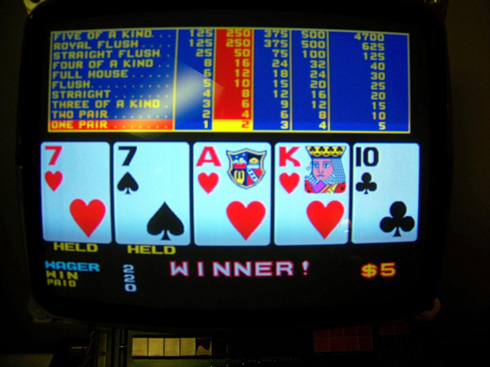
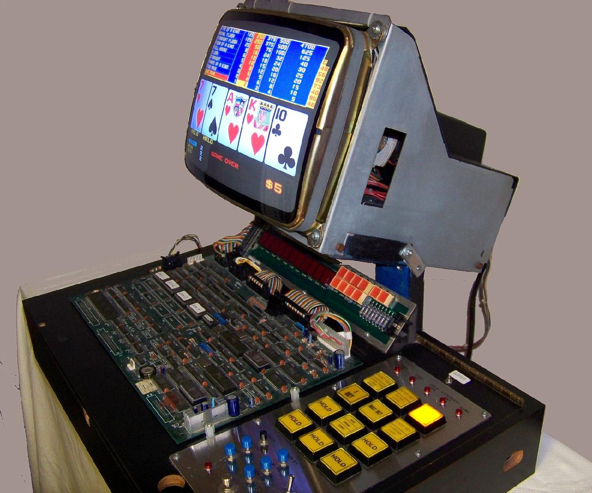
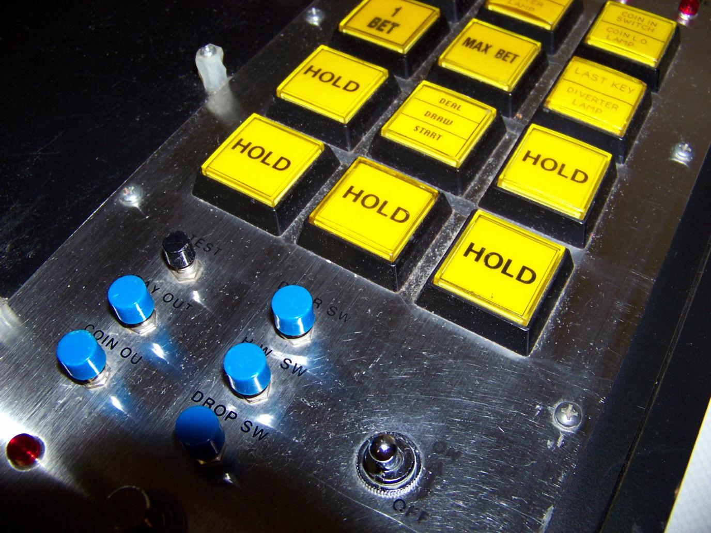
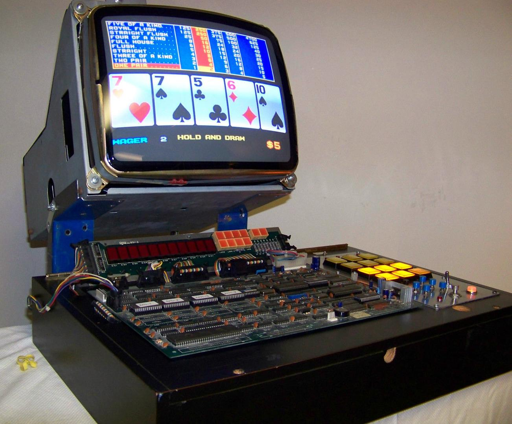

# Sigma Games Slot Machine

This is a repository of archaeological information on the Sigma Games Slot Machine. Two Hitachi 6809s are on the motherboard -- each one runs a separate copy of OS-9 Level 1 in ROM.

There are six ROMs on this board:

- 27C256 (32K) ROM labeled "POKER-01-00 SOUND L88-0399"
- 27C512 (64K) ROM labeled "SP55132 C-1204"
- 27C512 (64K) ROM labeled "2001-1"
- 27C512 (64K) ROM labeled "2001-2"
- 27C512 (64K) ROM labeled "2001-3"
- 27C512 (64K) ROM labeled "2001-4"

The ROM labeled "POKER-01-00 SOUND L88-0399" has the following OS-9/6809 modules:

```
  255 $E1 $14BD98 . CDRIVER
   83 $F1 $EE4A58 . CATCH
   79 $11 $48791D . EFFECT
   79 $11 $8E8F05 . MELODY
   47 $11 $2352F7 . STATION
   83 $F1 $25375D . TERM
   22 $E1 $B60C89 . ACIA
    5 $C1 $C22762 . SysGo
   83 $C0 $D7B3D3 . Init
    3 $C1 $A5F94E . Clock
    1 $41 $9C2D6B . SOUNDDATA
   15 $41 $85BCCE . SPEED
   34 $41 $5B659E . OPLDATA1
   34 $41 $742DB0 . OPLDATA2
   17 $41 $219182 . OPLDATA3
   34 $41 $CEBF58 . OPLDATA4
   17 $41 $F52E6E . OPLDATA5
   17 $41 $725B96 . OPLDATA6
   17 $41 $8C94B8 . OPLDATA7
   17 $41 $74CF50 . OPLDATA8
   34 $41 $9E06F7 . OPLDATA9
   17 $41 $A78710 . OPLDATA10
   17 $41 $235CC9 . OPLDATA11
   17 $41 $CB6A61 . OPLDATA12
   17 $41 $18311E . OPLDATA13
   17 $41 $6751C9 . OPLDATA14
   34 $41 $E8A316 . OPLDATA15
   17 $41 $B40795 . OPLDATA16
   34 $41 $A82831 . OPLDATA17
   34 $41 $5AF8A5 . OPLDATA18
   17 $41 $C028A1 . OPLDATA19
   17 $41 $96CA16 . OPLDATA20
   17 $41 $9E8BCD . OPLDATA21
   17 $41 $05598E . OPLDATA22
   17 $41 $77852F . OPLDATA23
   17 $41 $2D407A . OPLDATA24
   17 $41 $464CEF . OPLDATA25
   17 $41 $C7A722 . OPLDATA26
   34 $41 $FFF9B0 . OPLDATA27
   17 $41 $2F98E2 . OPLDATA28
   83 $C0 $D7B3D3 . Init
    5 $C1 $6B2FC1 . SysGo
    1 $C1 $F891E6 . Clock
   83 $F1 $D272F5 . PR
   83 $F1 $25375D . TERM
    4 $C1 $BD0579 . IOMan
    7 $D1 $04D9E6 . SCF
    8 $C1 $4448F7 . OS9p2
   83 $C0 $765B36 . Init
    1 $C1 $C5690A . Boot
   12 $C1 $297FC8 . OS9p1
```

The ROM labeled "SP55132 C-1204" has the following OS-9 modules:

```
   22 $11 $65F4A1 . ACINIT
   77 $11 $9A1C64 . First
    0 $11 $5A4C9F . LASTPRO
    1 $11 $4F229E . apm
    0 $11 $3E2E74 . linker
    0 $11 $C57EBD . uty
    0 $11 $66BA86 . ac_basen
    0 $11 $375904 . carduty
    5 $11 $F8065F . ODDS
    0 $11 $F9A592 . game
    0 $41 $3F7693 . MacTab
   83 $41 $C4B483 . GAMENO
  134 $11 $4C007A . apm
  134 $11 $0B018D . LASTPRO
  134 $11 $3862F4 . First
    0 $11 $17F244 . brinks
   52 $21 $D188CB . SDSERR
   67 $21 $70AC99 . VENDOUT
   71 $21 $B03EC3 . EERROR
   23 $21 $560798 . ECHECK
    1 $21 $E8E5C7 . ERESET
    1 $C1 $9BE237 . Clock
   22 $E1 $87C233 . ACIA
    3 $21 $B35B1A . PAYOUT
   67 $11 $9692A5 . ATNMES
    4 $21 $205755 . E0121
    0 $41 $A2C8ED . Comtab
   32 $21 $24909A . METERC
  111 $11 $30CD74 . MIKOHN
   83 $F1 $1602D9 . TERM
   52 $21 $5AC86B . CHERAM
  182 $21 $0EB6CF . NMIPRO
   76 $11 $46D803 . Shell
   52 $21 $6330A9 . LINKMOD
   83 $C0 $5FA6B7 . Init
    1 $C1 $4B1FE4 . SysGo
   83 $F1 $971D05 . TERM
    4 $C1 $BD0579 . IOMan
    7 $D1 $04D9E6 . SCF
    8 $C1 $4448F7 . OS9p2
   12 $C1 $EBCE0F ? OS9p1
```





